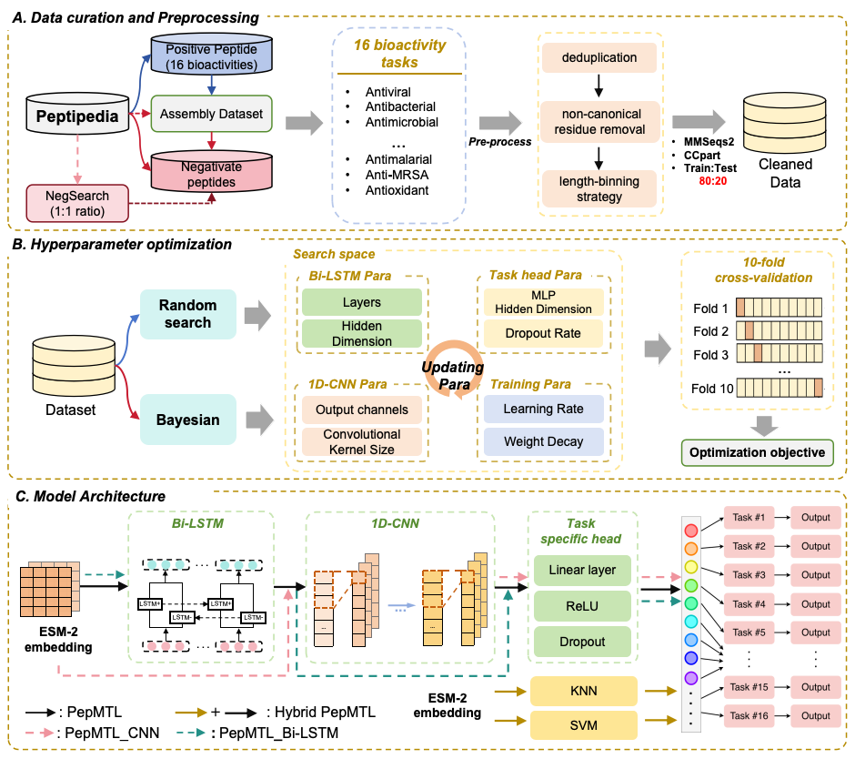

# E2EPepMTL: An Automated Multi-Task Deep Learning Framework with Protein Language Model for Peptide Bioactivity Prediction

E2EPepMTL is an end-to-end automated pipeline that streamlines peptide model development by coupling negative sequence selection, dataset partitioning, architecture search, hyperparameter tuning, model evaluation, and production model generation.



## Getting Started
```bash
git clone https://github.com/keith-study/E2EPepMTL.git
cd E2EPepMTL
```

## Quick Start
1. Full multi-task pipeline (from raw positives)
```bash
python -m main.py /
    /path/to/dir /
```
   
2. Resue pre-computed data (recommended for experiments)
```bash
python -m main.py /
    /path/to/dir /
    --reuse-data benchmark
```

## Pipeline Steps

1. Data curation – merge category-specific positive CSVs into a multi-label table
2. Negative sampling – length-binned, homology-aware negatives from Peptipedia
3. Homology partitioning – CCPart (MMseqs2) at user-defined identity threshold
4. ESM-2 embedding – mean-pooled (or per-token) representations
5. Model training – core model PepMTL (shared backbone + task heads)
6. Evaluation – 10-fold ensemble, per-task MCC, overall mean ± SEM, figures

All intermediate files (`train_dataset.csv`, `test_dataset.csv`, `*_embeddings.npy`, models, plots) are saved under `--outputdir`.
